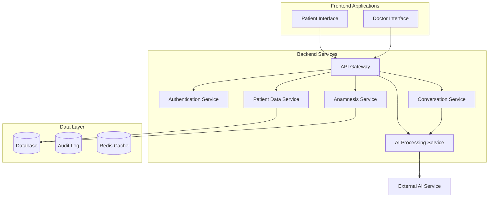

# Design Document

## Overview

MediBot is a comprehensive medical pre-consultation system consisting of three main components: a conversational AI agent for patient interaction, a backend API system for data management, and a doctor interface for consultation review. The system follows a microservices architecture with clear separation of concerns, ensuring scalability, maintainability, and HIPAA compliance.

## Architecture

### High-Level Architecture



### Technology Stack

**Frontend:**
- React.js with TypeScript for doctor interface
- React.js with accessibility libraries for patient chat interface
- Material-UI or similar for consistent medical-grade UI components
- WebSocket for real-time chat functionality

**Backend:**
- Node.js with Express.js for API services
- TypeScript for type safety
- JWT for authentication
- WebSocket support for real-time communication

**Database:**
- PostgreSQL for primary data storage (HIPAA compliant)
- Redis for session management and caching
- Separate audit logging database

**AI Integration:**
- Integration with open-source conversational AI (e.g., Rasa, Botpress)
- Natural Language Processing for symptom extraction
- Medical knowledge base integration

## Components and Interfaces

### 1. Conversational AI Agent

**Purpose:** Manages the three-phase patient interaction flow

**Key Components:**
- **Dialogue Manager:** Controls conversation flow and state
- **Natural Language Understanding (NLU):** Processes patient responses
- **Response Generator:** Creates empathetic, professional responses
- **Context Manager:** Maintains conversation context and patient data

**Interface:**
```typescript
interface ConversationService {
  startConversation(sessionId: string): Promise<ConversationResponse>
  processMessage(sessionId: string, message: string): Promise<ConversationResponse>
  getConversationState(sessionId: string): Promise<ConversationState>
  endConversation(sessionId: string): Promise<void>
}

interface ConversationResponse {
  message: string
  phase: 'greeting' | 'anamnesis' | 'closure'
  requiresInput: boolean
  extractedData?: Partial<PatientData>
  nextAction?: 'save_patient_data' | 'save_anamnesis' | 'end'
}
```

### 2. Patient Data Service

**Purpose:** Manages patient demographic and medical information

**Key Components:**
- **Patient Repository:** CRUD operations for patient data
- **Data Validation:** Ensures data integrity and format compliance
- **Encryption Service:** Handles data encryption/decryption

**Interface:**
```typescript
interface PatientDataService {
  createPatient(data: CreatePatientRequest): Promise<Patient>
  updatePatient(id: string, data: UpdatePatientRequest): Promise<Patient>
  getPatient(id: string): Promise<Patient>
  deletePatient(id: string): Promise<void>
}

interface Patient {
  id: string
  name: string
  dateOfBirth: string
  createdAt: Date
  updatedAt: Date
}
```

### 3. Anamnesis Service

**Purpose:** Manages medical consultation data and AI analysis

**Key Components:**
- **Anamnesis Repository:** Stores consultation details
- **AI Analysis Engine:** Generates summaries and recommendations
- **Medical Knowledge Integration:** Provides context for AI recommendations

**Interface:**
```typescript
interface AnamnesisService {
  saveAnamnesis(data: AnamnesisRequest): Promise<Anamnesis>
  getPatientAnamnesis(patientId: string): Promise<Anamnesis[]>
  updateAnamnesis(id: string, data: UpdateAnamnesisRequest): Promise<Anamnesis>
  generateAISummary(anamnesisId: string): Promise<AISummary>
}

interface Anamnesis {
  id: string
  patientId: string
  reasonForVisit: string
  symptoms: string
  duration: string
  aiSummary?: string
  aiRecommendations?: string[]
  createdAt: Date
}
```

### 4. Doctor Interface Service

**Purpose:** Provides consultation management for medical professionals

**Key Components:**
- **Consultation Dashboard:** Lists pending and completed consultations
- **Patient Detail View:** Comprehensive patient information display
- **Notes Management:** Doctor's notes and annotations
- **Review Workflow:** Consultation status management

**Interface:**
```typescript
interface DoctorService {
  getPendingConsultations(): Promise<Consultation[]>
  getConsultationDetails(id: string): Promise<ConsultationDetails>
  addDoctorNotes(consultationId: string, notes: string): Promise<void>
  markAsReviewed(consultationId: string): Promise<void>
  updatePatientData(patientId: string, data: PatientUpdate): Promise<void>
}
```

## Data Models

### Database Schema

**Patients Table:**
```sql
CREATE TABLE patients (
    id UUID PRIMARY KEY DEFAULT gen_random_uuid(),
    name VARCHAR(255) NOT NULL,
    date_of_birth DATE NOT NULL,
    created_at TIMESTAMP DEFAULT CURRENT_TIMESTAMP,
    updated_at TIMESTAMP DEFAULT CURRENT_TIMESTAMP,
    encrypted_data JSONB -- Additional encrypted patient data
);
```

**Anamnesis Table:**
```sql
CREATE TABLE anamnesis (
    id UUID PRIMARY KEY DEFAULT gen_random_uuid(),
    patient_id UUID REFERENCES patients(id),
    reason_for_visit TEXT NOT NULL,
    symptoms TEXT NOT NULL,
    duration VARCHAR(255) NOT NULL,
    ai_summary TEXT,
    ai_recommendations JSONB,
    created_at TIMESTAMP DEFAULT CURRENT_TIMESTAMP
);
```

**Consultations Table:**
```sql
CREATE TABLE consultations (
    id UUID PRIMARY KEY DEFAULT gen_random_uuid(),
    patient_id UUID REFERENCES patients(id),
    anamnesis_id UUID REFERENCES anamnesis(id),
    status VARCHAR(50) DEFAULT 'pending',
    doctor_notes TEXT,
    reviewed_at TIMESTAMP,
    created_at TIMESTAMP DEFAULT CURRENT_TIMESTAMP
);
```

**Audit Log Table:**
```sql
CREATE TABLE audit_log (
    id UUID PRIMARY KEY DEFAULT gen_random_uuid(),
    table_name VARCHAR(100) NOT NULL,
    record_id UUID NOT NULL,
    action VARCHAR(50) NOT NULL,
    old_values JSONB,
    new_values JSONB,
    user_id VARCHAR(255),
    timestamp TIMESTAMP DEFAULT CURRENT_TIMESTAMP
);
```

### Conversation State Management

**Conversation State:**
```typescript
interface ConversationState {
  sessionId: string
  currentPhase: 'greeting' | 'anamnesis' | 'closure'
  collectedData: {
    name?: string
    dateOfBirth?: string
    reasonForVisit?: string
    symptoms?: string
    duration?: string
  }
  attemptCount: number
  lastMessage: string
  isComplete: boolean
}
```

## Error Handling

### API Error Responses

**Standard Error Format:**
```typescript
interface APIError {
  error: {
    code: string
    message: string
    details?: any
    timestamp: string
  }
}
```

**Error Categories:**
- **Validation Errors (400):** Invalid input data
- **Authentication Errors (401):** Invalid or missing JWT token
- **Authorization Errors (403):** Insufficient permissions
- **Not Found Errors (404):** Resource not found
- **Server Errors (500):** Internal system failures
- **Service Unavailable (503):** External AI service failures

### Conversation Error Handling

**Error Recovery Strategies:**
1. **Misunderstood Input:** Ask for clarification once, then proceed with available data
2. **API Failures:** Graceful degradation with user notification
3. **Session Timeout:** Ability to resume conversation with context preservation
4. **Incomplete Data:** Specific prompts for missing information

## Testing Strategy

### Unit Testing
- **Service Layer:** Test all business logic and data transformations
- **Repository Layer:** Test database operations with mocked connections
- **AI Integration:** Mock external AI services for consistent testing
- **Validation Logic:** Test all input validation and sanitization

### Integration Testing
- **API Endpoints:** Test complete request/response cycles
- **Database Operations:** Test with real database connections
- **Authentication Flow:** Test JWT token generation and validation
- **Conversation Flow:** Test complete patient interaction scenarios

### End-to-End Testing
- **Patient Journey:** Complete conversation flow from greeting to closure
- **Doctor Workflow:** Full consultation review and note-taking process
- **Error Scenarios:** Test system behavior under various failure conditions
- **Accessibility Testing:** Ensure WCAG 2.1 AA compliance

### Security Testing
- **Data Encryption:** Verify encryption at rest and in transit
- **Authentication:** Test JWT token security and expiration
- **Input Sanitization:** Test against injection attacks
- **HIPAA Compliance:** Audit data handling and access controls

## Security and Compliance

### HIPAA Compliance Measures
- **Data Encryption:** AES-256 encryption for data at rest, TLS 1.3 for data in transit
- **Access Controls:** Role-based access with audit logging
- **Data Minimization:** Collect only necessary medical information
- **Audit Trails:** Complete logging of all data access and modifications
- **Data Retention:** Automated data purging based on retention policies

### Authentication and Authorization
- **JWT Tokens:** Secure token-based authentication with short expiration times
- **Role-Based Access:** Separate permissions for patients, doctors, and administrators
- **Session Management:** Secure session handling with Redis
- **API Rate Limiting:** Prevent abuse and ensure system stability

### Data Protection
- **Input Validation:** Comprehensive sanitization of all user inputs
- **SQL Injection Prevention:** Parameterized queries and ORM usage
- **XSS Protection:** Content Security Policy and input encoding
- **CORS Configuration:** Restricted cross-origin requests